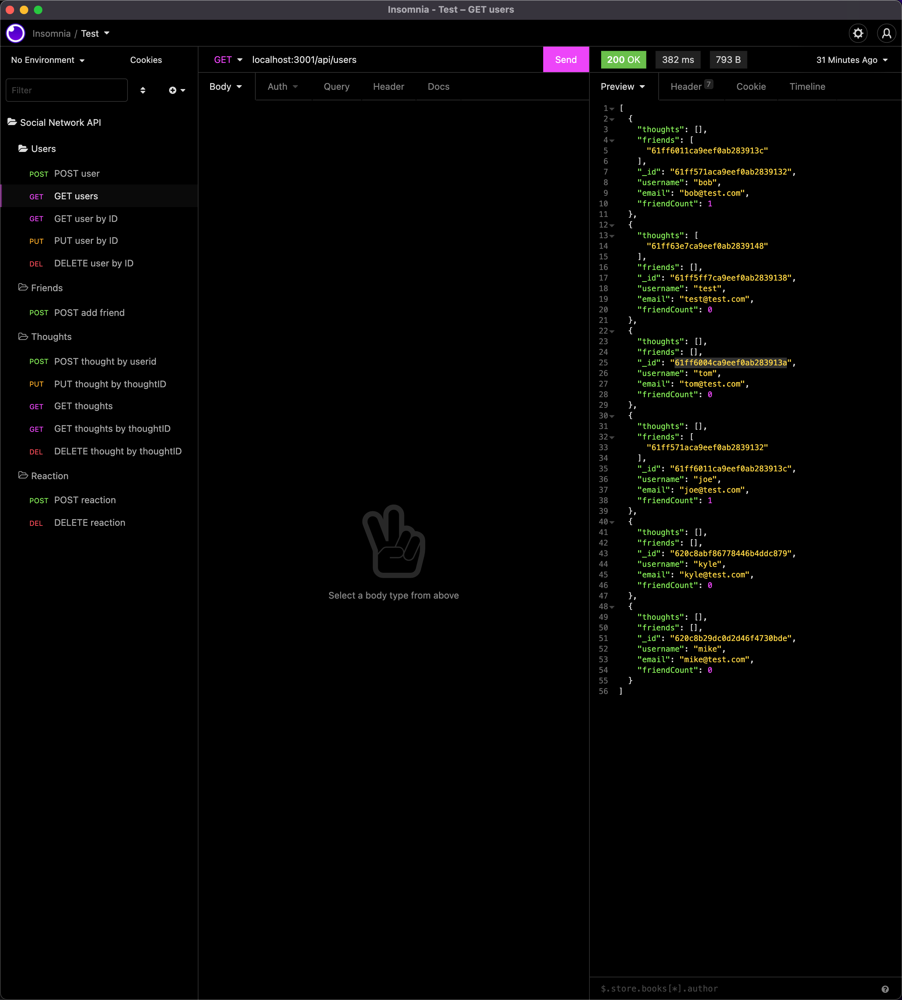

# social-network-api

## Description

Built an API for a social network web application where users can share their thoughts, react to friends’ thoughts, and create a friend list.

## Usage

- [Video](https://youtu.be/3QW8qegxAUU)
- [Github](https://github.com/ngolston/social-network-api)
- README.md

## Technology

- HTML
- CSS
- JS
- Node.js
- NPM's

## Credits

- Dillan Mansor
- Davis Ransom
- Jeffrey Young
- Thao Nguyen
- Parisa Ostovari
- Caroline Pastorelli
- And Everyone Else 😁🙏🏾
